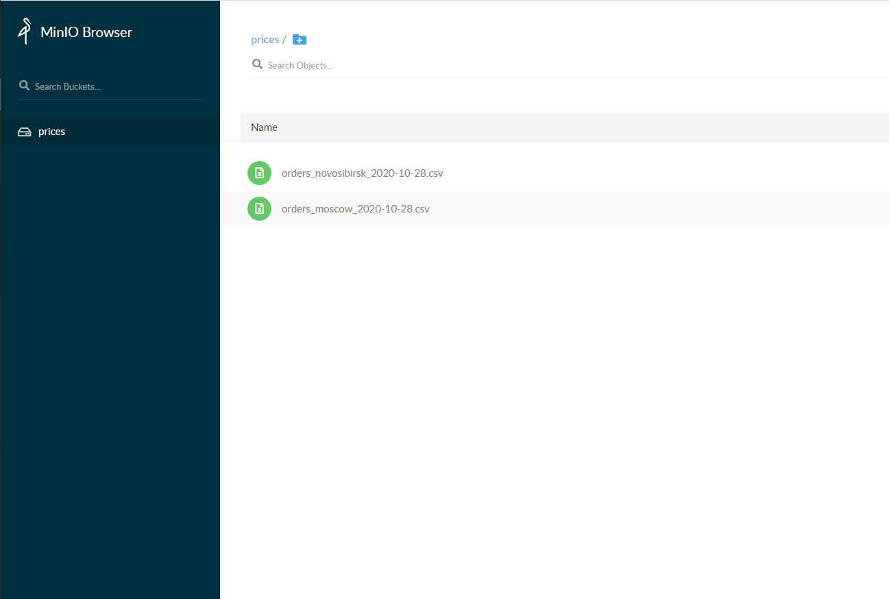

* Автор: David Amirkhanov (@websofter) https://wsofter.ru
* Видео: https://youtu.be/Y7xsMX1GXC8

# Запуск через docker

### Поднимаем контейнеры docker-compose
`
$ docker-compose up -d
`
### Данные для MinIO
*  - URL: localhost:9000
*  - MINIO_ACCESS_KEY: access123
*  - MINIO_SECRET_KEY: secret123

### Запуск примера
`$ cd www`\
`$ composer init` \
`$ composer require aws/aws-sdk-php` \
`$ php index.php`

